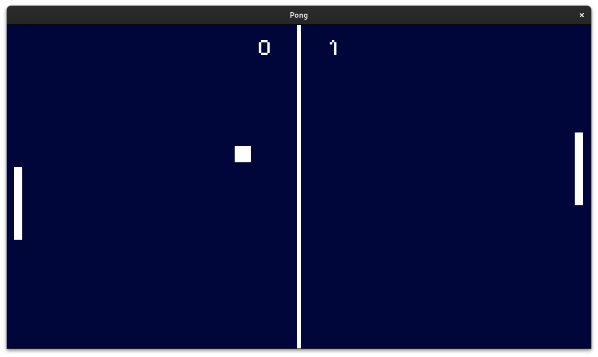

# Pong

My first game on the Godot engine.

## Run

Find for the executable for your platform at [releases](https://github.com/Irineu333/Pong-Godot/releases).

## Build

Clone the project and open it in [Godot engine](https://godotengine.org/download/archive/) 4.2.x.

## Screenshots

